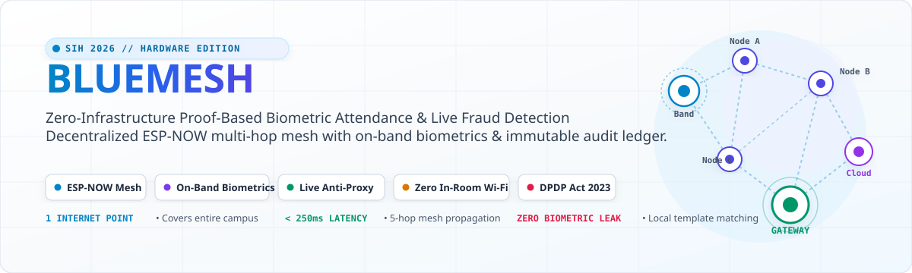
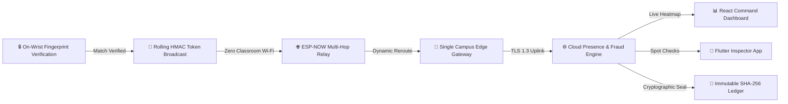
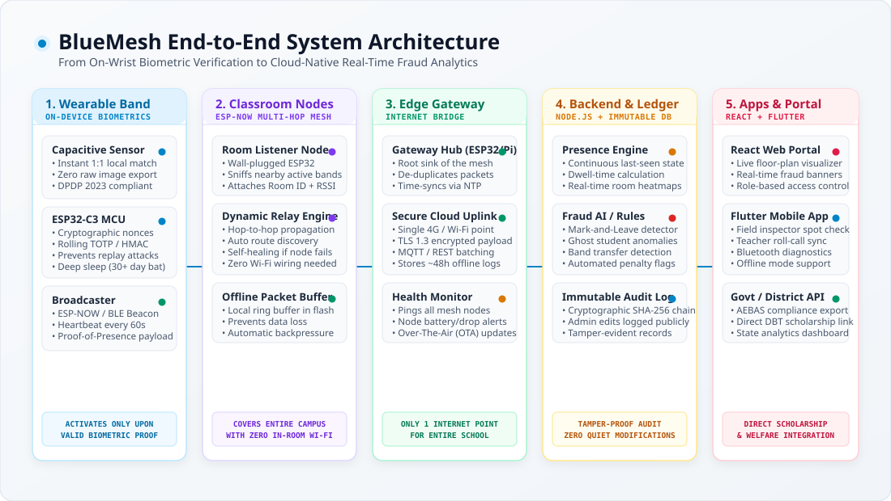
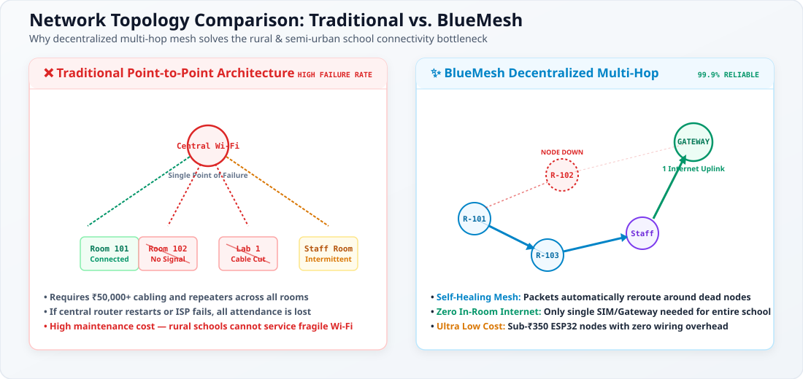
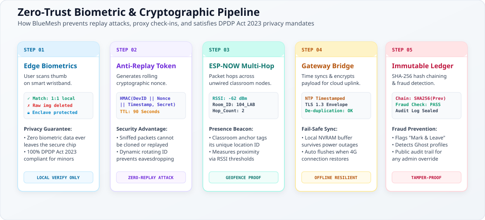
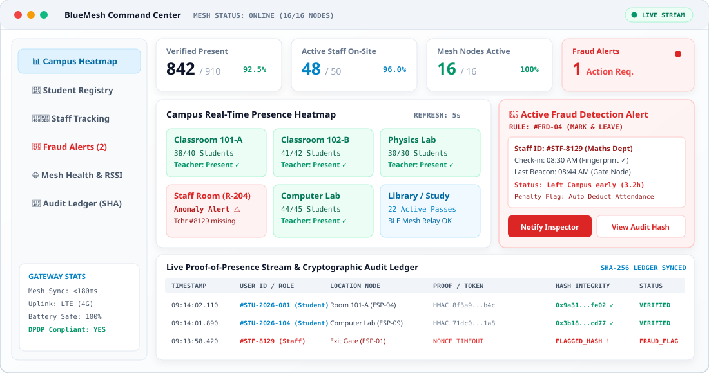
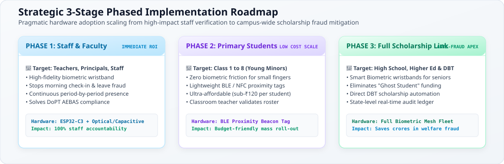

<div align="center">

# 🌐 BLUEMESH
### Zero-Infrastructure Proof-Based Attendance & Real-Time Fraud Prevention System

[](https://sih.gov.in)
[](#)
[](#)
[](#)
[](#)

<br/>



<p align="center">
  <b>An offline-first, decentralized biometric mesh system that stops student scholarship ghost counts and teacher absenteeism with zero classroom internet wiring.</b>
</p>

[The Problem](#-the-ground-reality--problem-statement) •
[The Solution](#-the-bluemesh-solution) •
[System Architecture](#-system-architecture) •
[Mesh Topology](#-decentralized-mesh-vs-traditional-wi-fi) •
[Privacy & Security](#-zero-trust-privacy--security-pipeline) •
[Command Center](#-real-time-command-center--analytics) •
[Cost Feasibility](#-hardware-feasibility--cost-breakdown) •
[Phased Roadmap](#-3-stage-phased-rollout-roadmap) •
[Impact & Benefits](#-measurable-impact--social-benefits)

---

</div>

## 📌 Executive Summary

Government welfare initiatives, Direct Benefit Transfer (DBT) scholarships, and mid-day meal programs lose thousands of crores annually to **"Ghost Students"** (inflated rolls created solely to siphon funds) and **teacher absenteeism** ("mark-and-leave" practices). Traditional biometric devices fail in rural and semi-urban schools due to erratic power, absent in-classroom Wi-Fi/LAN cabling, and fragile optical wall units.

**BlueMesh** is an innovative proof-based presence ecosystem:
- **On-Band Local Biometrics:** Biometric fingerprint matching executes solely on the secure enclave of wearable wristbands. Raw biometric templates never leave the band.
- **Decentralized ESP-NOW Mesh:** Battery-backed sub-₹350 ESP32 room nodes listen for verified cryptographically signed beacons and relay them hop-by-hop across classrooms.
- **Single Point Internet Uplink:** The entire school requires only **one** internet gateway (cellular 4G or Wi-Fi). If any node goes down, the mesh dynamically self-heals and reroutes packets.
- **Continuous Proof-of-Presence:** Periodic cryptographic heartbeats eliminate "mark-in and run" frauds by tracking live dwell time across campus.
- **Tamper-Proof Audit Ledger:** Every check-in, beacon heartbeat, and administrative override is signed into a cryptographically sealed SHA-256 append-only ledger.

---

## 🎯 The Ground Reality & Problem Statement

```
┌───────────────────────────┐     ┌───────────────────────────┐
│     GHOST STUDENTS        │     │    TEACHER ABSENTEEISM    │
│  Inflated enrollment to   │     │   Morning punch-in and    │
│  siphon scholarship funds │     │   immediate campus exit   │
└─────────────┬─────────────┘     └─────────────┬─────────────┘
              │                                 │
              ▼                                 ▼
┌─────────────────────────────────────────────────────────────┐
│                   INFRASTRUCTURE BARRIER                    │
│    90%+ rural & semi-urban schools lack in-room Wi-Fi,      │
│     stable broadband, or Ethernet cabling per classroom    │
└─────────────────────────────────────────────────────────────┘
```

| Problem in Current Systems | Real-World Impact | How BlueMesh Solves It |
| :--- | :--- | :--- |
| **Inflated Enrollment Rolls** | Schools register non-existent ("Ghost") students to claim government scholarships & rations. | **Proof-Based Attendance:** Scholarships disbursed only upon verified on-device fingerprint heartbeats across the semester. |
| **"Mark & Leave" Absenteeism** | Staff mark morning attendance on stationary wall biometric units and immediately leave for private work. | **Continuous Presence Tracking:** Periodic ambient heartbeats track room dwell times; flags staff who vanish post check-in. |
| **Quiet Database Manipulation** | Manual paper registers and editable SQL tables allow local admins to secretly alter past records. | **Immutable Cryptographic Ledger:** SHA-256 hash chaining ensures any retroactive change is publicly flagged and mathematically detectable. |
| **Lack of Classroom Internet** | Rural schools cannot afford ₹50,000+ router installations, Ethernet cabling, and repeaters per room. | **Zero-Internet Multi-Hop Mesh:** ESP-NOW protocol relays data wirelessly up to 500m across rooms to a single cellular gateway. |
| **Biometric Privacy & Minor Data** | Cloud storage of students' raw biometric templates creates catastrophic data leakage vulnerabilities. | **DPDP Act 2023 Edge Compliance:** Fingerprints are verified 1:1 locally in device silicon. Only short-lived HMAC tokens are broadcast. |

---

## 💡 The BlueMesh Solution

BlueMesh replaces fragile, stationary biometric portals with an active, ambient proof-of-presence network.



### Core Advantages at a Glance
- 🔋 **30-Day Battery Deep Sleep:** Band radio remains completely powered down until a valid fingerprint triggers enrollment broadcast, conserving micro-amps.
- 🔄 **Dynamic Self-Healing Mesh:** If Room 102's node loses power, packets from Room 101 immediately reroute through Room 103 without packet loss.
- 🛡️ **Anti-Replay Cryptographic Nonces:** Each broadcast packet contains a dynamic rolling token with a 90-second Time-To-Live (TTL), defeating RF sniffer and replay cloning attacks.
- 📍 **Passive Geofencing & Ranging:** Received Signal Strength Indicator (RSSI) calibration calculates student proximity and validates specific classroom presence.

---

## 🏛️ System Architecture

BlueMesh connects edge hardware to cloud analytics and cross-platform management applications across a cohesive 5-tier pipeline:



### 1. Wearable Smart Band (Edge Biometric Anchor)
- **Local Verification:** Features a capacitive/optical biometric sensor that performs 1:1 local template matching directly in device silicon.
- **Privacy Assurance:** Raw fingerprint images are erased instantly after match calculation and never leave the device.
- **Power Optimization:** Ultra-low-power deep sleep mode wakes up only on physical finger touch interrupt.

### 2. Classroom Mesh Relay Nodes (Campus Subnet)
- **Zero In-Room Wiring:** Small wall-mounted ESP32 nodes installed in classrooms, labs, and staff rooms.
- **Dynamic Hop-by-Hop Relaying:** Listens for authenticated band broadcasts, tags the room identifier and signal strength (RSSI), and forwards packets to neighboring nodes.
- **Offline Resilience:** Embedded circular flash buffer preserves up to 5,000 attendance events locally during campus power outages.

### 3. Central Edge Gateway (Internet Bridge)
- **Single Internet Point:** One master gateway equipped with a 4G LTE SIM card or administrative Wi-Fi serves the entire school.
- **Packet De-Duplication:** Aggregates multi-path signals, eliminates duplicate mesh frames, and synchronizes precision NTP timestamps.

### 4. Backend Analytics & Fraud Detection Engine
- **Continuous Presence Tracking:** Maintains real-time last-seen timestamps and room dwell-time counters for all campus occupants.
- **Fraud Rules Engine:** Automatically flags suspicious anomalies such as premature staff departures and ghost student records.
- **Immutable Ledger:** Chains every check-in event using SHA-256 cryptographic hashing to prevent silent record tampering.

### 5. Management Applications & Government Portals
- **React Command Center:** Real-time campus floor-plan heatmap, live fraud notifications, and audit log explorers.
- **Flutter Mobile App:** Enables surprise inspections, offline roll-call synchronization, and field diagnostics by education officers.
- **Direct DBT Integration:** Automated data export for state welfare departments and AEBAS compliance audits.

---

## 🌐 Decentralized Mesh vs. Traditional Wi-Fi

Traditional school attendance deployments rely on centralized Wi-Fi routers that fail due to thick masonry walls, limited radio coverage, and fragile cabling.



### Why BlueMesh Outperforms Traditional Networks

| Metric | Traditional Wi-Fi Setup | BlueMesh Decentralized Mesh |
| :--- | :--- | :--- |
| **Internet Requirement** | High-speed Wi-Fi required in **every** classroom | Only **1 Internet Point** needed for entire campus |
| **Cabling & Infrastructure** | ₹50,000+ for routers, repeaters & Ethernet lines | **Zero cabling**; sub-₹350 plug-and-play wireless nodes |
| **Failure Tolerance** | If main router resets, entire campus is offline | **Self-healing**; packets automatically reroute around dead nodes |
| **Range & Penetration** | Struggles through concrete walls & long corridors | Multi-hop hops room-to-room up to 500m |
| **Latency** | Frequent packet drops and re-association delays | **Sub-200ms** end-to-end packet delivery |

---

## 🔐 Zero-Trust Privacy & Security Pipeline

BlueMesh was designed from the ground up to comply with India's **Digital Personal Data Protection (DPDP) Act 2023** and **DoPT AEBAS** guidelines.



### 1. Edge-Only Biometrics (DPDP Act Compliant)
Minors' biometric templates are strictly preserved inside the tamper-resistant hardware enclave of the user's wristband. No biometric data is ever broadcast over the air or stored on cloud servers.

### 2. Anti-Replay Cryptographic Token Model
Standard Bluetooth beacons broadcast static identifiers that can be easily recorded and cloned. BlueMesh generates a dynamic cryptographic token for each broadcast:
- Uses a rolling pseudo-random nonce and device secret.
- Packets expire automatically after 90 seconds (TTL), rendering recorded signals useless.

### 3. Immutable Append-Only Ledger
All attendance logs and administrative adjustments are cryptographically chained using SHA-256 hashing. Any retroactive modification breaks the validation chain across all subsequent blocks, providing complete transparency for district auditors.

---

## 📊 Real-Time Command Center & Analytics

The BlueMesh Command Center provides comprehensive, real-time situational awareness across the entire campus.



### Core Command Center Features
- 🗺️ **Live Campus Heatmap:** Color-coded room occupancy grid showing live student counts and teacher presence.
- 🚨 **Automated Fraud Trigger Cards:** Instant visual alerts when staff or students violate dwell-time requirements.
- 📶 **Mesh Node Health Telemetry:** Real-time diagnostics on node online status, hop paths, and packet delivery rates.
- 📜 **Cryptographic Audit Explorer:** Interactive inspector to verify block hashes and inspect administrative audit trails.

---

## 🛠️ Hardware Feasibility & Cost Breakdown

BlueMesh utilizes affordable, commercially available components with readily accessible supply chains across India.

```
┌─────────────────────────────────────────────────────────────┐
│                 CAMPUS HARDWARE ECOSYSTEM                   │
├──────────────────────────────┬──────────────────────────────┤
│ 50x Biometric Bands (Staff)  │  15x Classroom Mesh Nodes    │
│ [ESP32-C3 + Fingerprint]     │  [ESP32 Wall Units]          │
├──────────────────────────────┴──────────────────────────────┤
│ 1x Master Gateway [ESP32 + 4G LTE SIM Bridge]               │
└─────────────────────────────────────────────────────────────┘
```

| Component | Purpose / Specification | Approx. Unit Cost (INR) | Approx. Unit Cost (USD) |
| :--- | :--- | :--- | :--- |
| **ESP32-C3 SuperMini** | Wearable Band Core MCU (RISC-V, BLE 5.0, ESP-NOW) | ₹220 | $2.60 |
| **Capacitive Fingerprint Sensor** | Low-power 1:1 on-device match sensor | ₹480 | $5.70 |
| **LiPo Battery (300mAh) + BMS** | Ultra-thin rechargeable battery with TP4056 charging IC | ₹95 | $1.15 |
| **ESP32-WROOM-32D** | Classroom Mesh Relay Node (Dual-core, External Antenna) | ₹190 | $2.25 |
| **5V 1A USB Power Brick** | Wall plug power supply for classroom nodes | ₹65 | $0.80 |
| **ESP32 Gateway + 4G LTE Bridge** | Central campus internet master sink (Quectel 4G LTE) | ₹1,250 | $15.00 |
| **Custom 3D Printed Casing** | Ergonomic strap enclosure + Wall mount node cases | ₹40 | $0.50 |

> **Cost Feasibility:** Equipping a 15-classroom school with 1 Central Gateway and 15 Mesh Nodes costs **under ₹4,500 total infrastructure investment** — representing a >90% savings compared to traditional Wi-Fi router wiring.

---

## 🚀 3-Stage Phased Rollout Roadmap

To ensure smooth adoption and address biological considerations (such as fingerprint sensor reliability on young children), BlueMesh uses a **3-Stage Implementation Roadmap**:



### Phase 1: Faculty & Staff Accountability (Immediate High-Impact ROI)
- **Target:** Teachers, Principals, Administrative and Lab Staff.
- **Hardware:** ESP32 Biometric Wristbands.
- **Objective:** Eliminate morning check-in and leave fraud, enforce period-wise lecture attendance, and ensure compliance with DoPT AEBAS directives.

### Phase 2: Primary & Middle School Students (Low-Cost Mass Deployment)
- **Target:** Class 1 to Class 8 (Younger minors).
- **Hardware:** Ultra-low-cost BLE/NFC Proximity Beacon Tags (sub-₹120).
- **Objective:** Bypasses fingerprint sensor difficulties with young children's delicate ridge patterns. Classroom nodes detect student tags while teachers verify rosters.

### Phase 3: Senior Students & Direct Benefit Transfer (DBT) Integration
- **Target:** High School (9th-12th), Colleges, and Welfare Scholarship Recipients.
- **Hardware:** Full-scale Biometric Wearable Bands.
- **Objective:** Automated verification for scholarship fund disbursements, completely eliminating "Ghost Student" scams from state education treasuries.

---

## 🌟 Measurable Impact & Social Benefits

```
┌─────────────────────────────────────────────────────────────┐
│                    TRIPLE BOTTOM-LINE IMPACT                │
├──────────────────────────────┬──────────────────────────────┤
│ 1. FINANCIAL INTEGRITY       │ 2. EDUCATIONAL QUALITY       │
│ • Eliminates welfare fraud   │ • Guarantees teacher presence│
│ • Direct DBT scholarship     │ • Eliminates proxy roll-calls│
│   verification               │ • Real-time student safety   │
├──────────────────────────────┴──────────────────────────────┤
│ 3. ADMINISTRATIVE EFFICIENCY                                │
│ • Saves 20+ teacher mins daily spent on manual roll-calls   │
│ • Zero quiet modifications with tamper-proof audit trails    │
└─────────────────────────────────────────────────────────────┘
```

- **Social Equity:** Direct scholarship funds reach genuine, attending students rather than fraudulent intermediary rolls.
- **Teacher Accountability:** Protects dedicated teachers from blanket administrative blame while deterring absenteeism.
- **District Intelligence:** Education officers obtain verified, real-time campus data rather than waiting months for retrospective audits.

---

## 📜 Regulatory & Research References

1. **DoPT AEBAS Mandate (2023):** Department of Personnel and Training guidelines regarding biometric attendance verification and audit trail maintenance in educational institutions.
2. **Digital Personal Data Protection (DPDP) Act, 2023 (India):** Section 9 mandates regarding processing and protection of biometric and personal identifiable data (PII) of minors.
3. **State Educational Attendance Circulars:** Directives from Punjab, Haryana, Himachal Pradesh, and Karnataka state school boards on mitigating proxy roll-calls and midday meal discrepancies.
4. **IEEE 802.11 Action Frames & ESP-NOW:** Peer-to-peer connectionless wireless communication protocols for low-overhead IoT telemetry.

---

## 👥 Hackathon Team & Acknowledgements

- **Event:** Smart India Hackathon (SIH) 2026
- **Category:** Hardware
- **Theme:** Smart Education
- **Project Name:** BlueMesh – Proof-Based Attendance & Fraud Detection System

<br/>

<div align="center">

Made with 💙 for <b>Smart India Hackathon 2026</b>. Empowering schools with tamper-proof, zero-infrastructure biometric intelligence.

</div>
